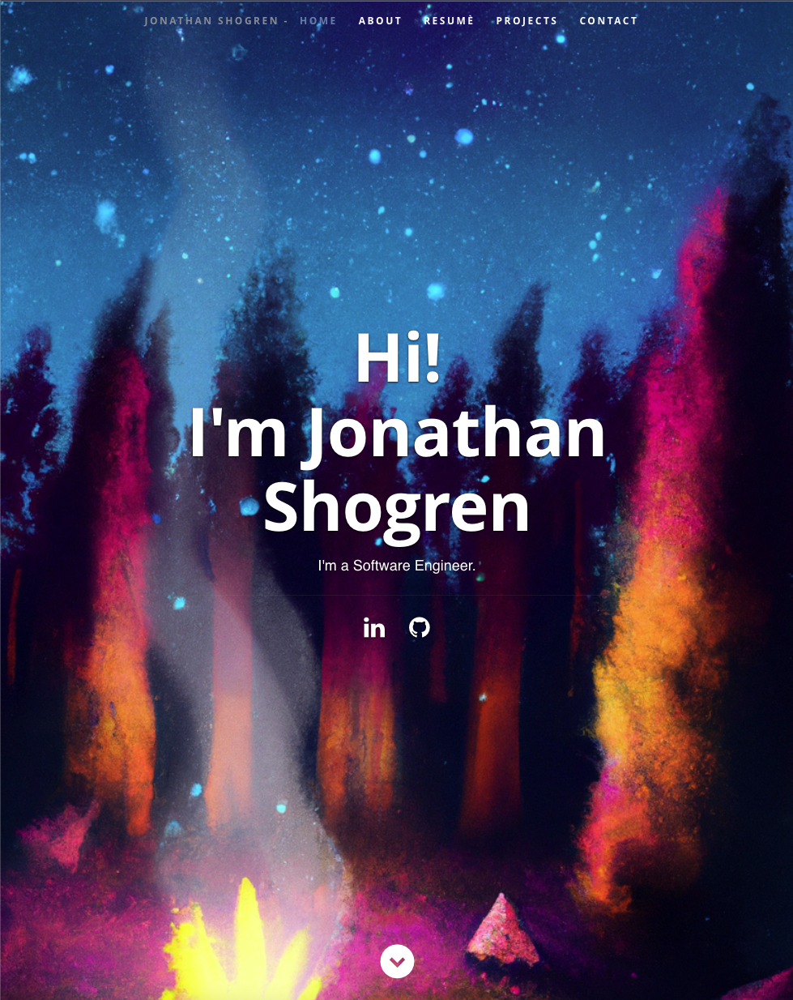

# 20-React-Portfolio

## Table of Contents

[1. Description](#Description)

[2. Screen Shot](#Screen_Shot)

[3. Additional Notes](#Additional_Notes)  

## Description

This is the week 20 project "React Portfolio" that updates my portfolio site to show off past projects using a site build with React.

User Story:

```text
AS AN employer looking for candidates with experience building single-page applications
I WANT to view a potential employee's deployed React portfolio of work samples
SO THAT I can assess whether they're a good candidate for an open position
```

## Screen Shot



## Additional Notes

Currently, the contact form does have a backend that sends an email. That functionality will be added later.

The app can be found live at [https://shogren.github.io/20-React-Portfolio/](https://shogren.github.io/20-React-Portfolio/)